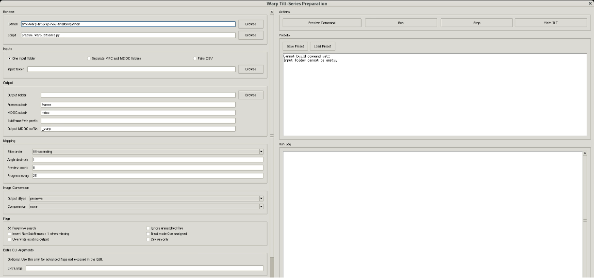

# STEM tomography preparation GUI

A desktop interface for preparing MRC tilt-series stacks and MDOC acquisition
metadata for a Warp-based STEM tomography workflow.

The application exports one TIFF image per tilt, rewrites MDOC image paths,
previews image-to-angle assignments, and extracts tilt-angle lists. It supports
the computational preparation of plastic-section HAADF-STEM data without
requiring a change to the detector configuration.

> [!IMPORTANT]  
> This GUI prepares inputs. Reconstruction, denoising and segmentation are performed
> separately in Warp, IMOD and other downstream tools. Those tools
> are not bundled or run by this application.

## Install and launch

Clone this repository:

```bash
git clone https://github.com/nobias-fht/stem-tomography-gui.git
cd stem-tomography-gui
```

Run the interface with `uv` (see [uv installation guidelines](https://docs.astral.sh/uv/getting-started/installation/)):

```bash
uv run stem-tomography-gui
```


## Prepare a dataset



Configure input and output paths on the left, then preview and run preparation
on the right. See the [illustrated GUI guide](docs/GUI.md) for the preview
controls, presets and MDOC-to-TLT utility. The screenshot shows the interface
before an input folder has been selected. Its paths and options are examples,
not dataset-specific recommendations.

1. Select an input folder containing matching MRC and MDOC files, separate image
   and metadata folders, or an explicit pairs CSV.
2. Choose an output directory separate from the raw input directory.
3. Select the slice order that matches the actual stack. `tilt-ascending` is the
   supplied default, not a universal acquisition setting.
4. Preview the command and use **Dry run only** to inspect image-to-angle mapping.
5. After checking the mapping, disable dry run and run the conversion.
6. Retain the processing summary and import the prepared data into the downstream
   workflow using the sampling and acquisition parameters of your dataset.

The example preset starts in dry-run mode and uses `frames` as the MDOC image-path
prefix. Update its paths before running it. Overwriting is disabled by default.

### Choosing the image order

| Option | Interpretation |
| --- | --- |
| `tilt-ascending` | Stack slices correspond to increasing tilt angles. |
| `tilt-descending` | Stack slices correspond to decreasing tilt angles. |
| `zvalue` | Stack slices follow MDOC ZValue order. |
| `block` | Stack slices follow the order of blocks in the MDOC. |

Do not infer the correct mapping from filenames alone. Check the acquisition
metadata and the ordering of the actual image stack.

### Output layout

```text
warp_prep_output/
├── frames/                     # One TIFF per tilt
├── mdoc/                       # Rewritten MDOC files
└── prepare_warp_summary.csv     # Processing summary
```

## Downstream Warp commands

The [Warp command guide](docs/warp_commands.md) explains settings creation, projection
export, tilt-series import, stack creation, IMOD alignment import, full and
odd/even reconstruction, and optional Noise2Map denoising. It uses generic paths
and named parameter placeholders, with no dataset-specific numerical values or
Slurm resource directives.

## Command-line use

```bash
uv run prepare-warp-tiltseries \
  --input /path/to/raw \
  --output /path/to/warp_prep_output \
  --slice-order tilt-ascending \
  --dry-run
```

Remove `--dry-run` only after checking the mapping. Use `--help` for the full
option list, including explicit file pairing and image conversion settings.

To extract a tilt-angle list in MDOC block order:

```bash
uv run mdoc-to-tlt \
  --mdoc /path/to/series.mdoc \
  --output /path/to/angles.tlt \
  --order block
```

The angle list must match the projection order expected by the downstream tool.
Sorting angles alone does not reorder an image stack.

## Documentation

- [GUI guide](docs/GUI.md)
- [Preparation script reference](docs/prepare_warp_tiltseries.md)
- [Warp commands](docs/warp_commands.md)

## Set-up test

To run a dummy pipeline test, do:

```bash
uv run python tests/test_preparation.py
```
