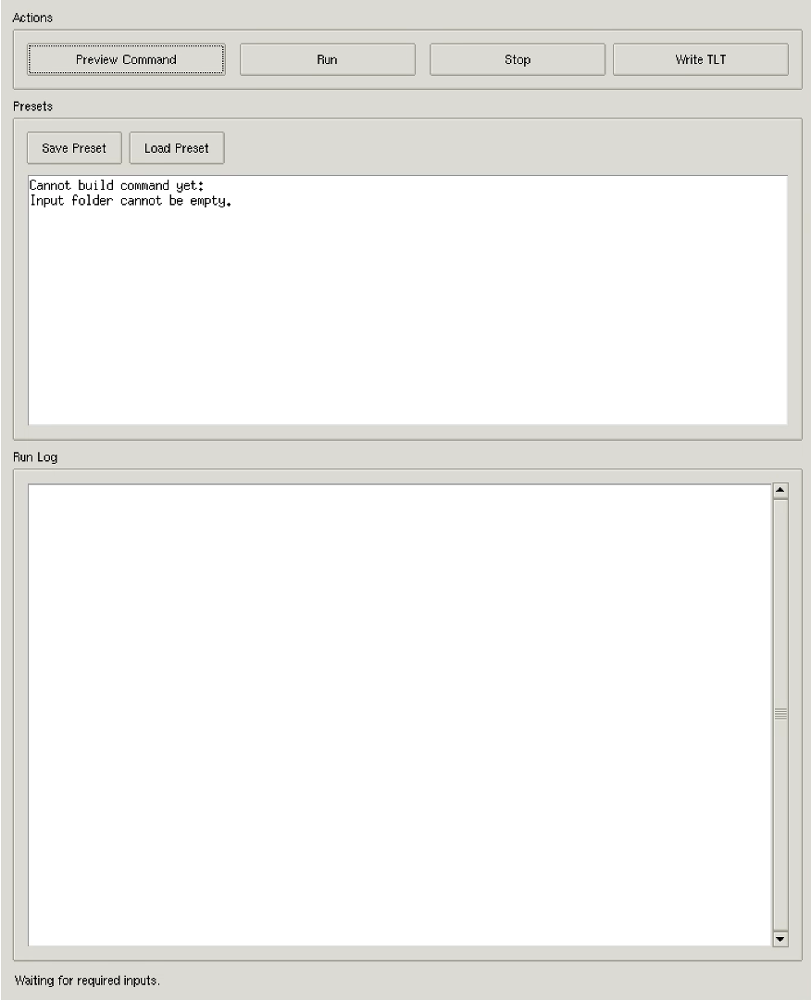
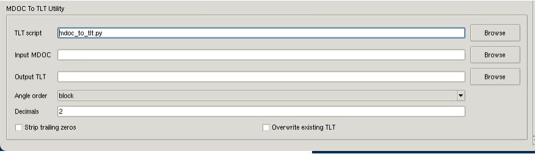

# Illustrated GUI guide

The Warp Tilt-Series Preparation GUI prepares images and metadata for downstream
processing. It runs the preparation engine and provides a separate MDOC-to-TLT
utility. Reconstruction and restoration are performed separately.

## 1. Install and open the GUI

From the repository directory:

```bash
uv run stem-tomography-gui
```

`uv` creates and manages the project environment automatically. The GUI requires
Tkinter and a graphical desktop. See the [main README](../README.md) for the uv
installation link and command-line alternatives.

## 2. Set the inputs and output


*Main window before selecting a dataset. Paths and settings shown are illustrative;
use your own environment, data paths and acquisition ordering.*

1. The **Runtime** fields are populated from the uv-managed environment and the
   installed package. Change them only when intentionally running another copy
   of the preparation engine.
2. Under **Inputs**, choose **One input folder**, **Separate MRC and MDOC folders**
   or **Pairs CSV**, then fill in the corresponding paths.
3. Under **Output**, select a directory separate from the original data. The
   example preset uses `frames` and `mdoc` for the output subdirectories, `frames`
   for **SubFramePath prefix**, and `_warp` for **Output MDOC suffix**.
4. Under **Mapping**, select the **Slice order** matching the actual stack. Check
   the preview against the metadata; `tilt-ascending` is not correct for every
   dataset. **Preview count** controls how many assignments are displayed.
5. Under **Image Conversion**, select the required output dtype and compression.
   The example uses `preserve` and `none`.
6. Under **Flags**, enable **Dry run only** for the first pass and leave
   **Overwrite existing output** off unless replacement is intended.

Use **Extra CLI Arguments** only for options you understand and need beyond the
visible fields. The [script reference](prepare_warp_tiltseries.md) explains
additional options.

## 3. Preview, save settings and run



*The message “Cannot build command yet: Input folder cannot be empty” appears
because the input folder has not been selected. Select an input folder, or finish
the fields for the other input mode, before previewing again. This image shows
the initial state, not a successful processing run.*

1. Click **Preview Command** to inspect the command assembled from your settings.
2. With **Dry run only** enabled, click **Run** and inspect the **Run Log** for
   image-to-angle assignments. Previewing the command alone does not execute
   the mapping checks.
3. When paths and mapping are correct, disable **Dry run only** and click **Run**
   again to write the prepared files. Follow progress and any errors in the
   **Run Log**. **Stop** requests termination of the running process; inspect
   the output directory before restarting an interrupted conversion.
4. Use **Save Preset** to retain settings and **Load Preset** to restore them.
   Recheck paths and mapping when using a preset with another dataset.

After conversion, inspect `frames/`, `mdoc/` and `prepare_warp_summary.csv` before
continuing with the downstream workflow.

## 4. Export a tilt-angle list



*The MDOC-to-TLT utility extracts angles independently of image conversion.
Scroll in the configuration panel if this section is outside the visible area.*

1. Leave **TLT script** at its package-provided default unless intentionally
   running another copy of the utility.
2. Select **Input MDOC** and choose a path for **Output TLT**.
3. Set **Angle order** to match the projection ordering expected downstream.
   `block` follows the order of records in the MDOC. Sorting an angle list does
   not reorder the image stack.
4. Set **Decimals** as needed. **Strip trailing zeros** changes numeric formatting;
   it does not change the ordering.
5. Leave **Overwrite existing TLT** off unless replacement is intended, then
   click **Write TLT** in the Actions panel.

Verify that the angle count and ordering match the projection stack that will be
used with the `.tlt` file.

## Continue with Warp

After checking the prepared output, follow the [generic Warp command guide](./warp_commands.md)
for import, alignment transfer, reconstruction and optional Noise2Map denoising.
Fill in the paths and dataset-specific parameters before running the templates.
